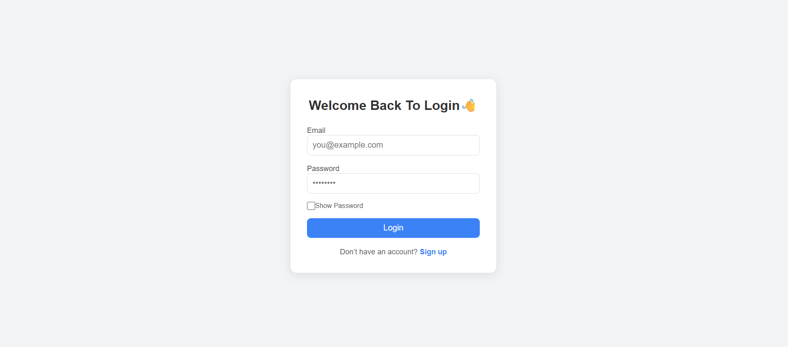
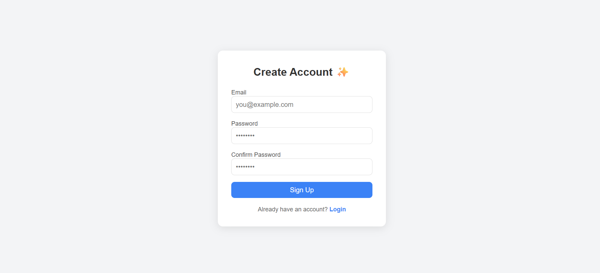
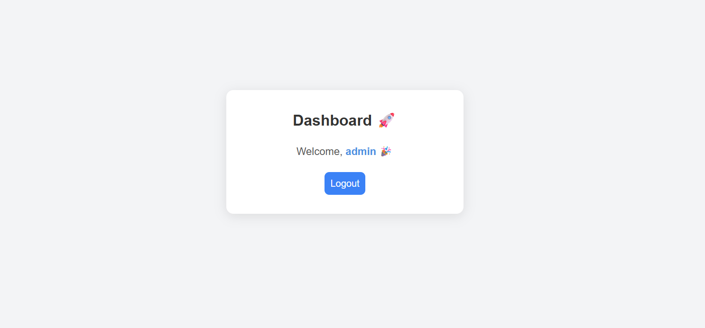

# Klickks Full Stack Assignment

## 1. Project Objective

This project implements a simple **login and logout flow** using **React.js** for the frontend and **Node.js (Express)** for the backend, with **SQLite** as the database. Users can register, log in, stay logged in via session cookies, and log out.

---

## 2. Tech Stacks

### Frontend
- **React.js** – Frontend library for building UI
- **React Router v6** – Client-side routing
- **Axios** – HTTP requests to backend
- **CSS** – Styling components

### Backend
- **Node.js** – Backend runtime
- **Express.js** – Web framework for API routes
- **SQLite3** – Database for storing user data
- **bcryptjs** – Hash passwords
- **cookie-parser** – Parse cookies for session management
- **express-session** – Session handling middleware
- **cors** – Enable cross-origin requests

---

## 3. Features

- **User Registration (Sign Up)** – Create a new account with email and password.  
- **Secure Passwords** – Passwords are hashed using `bcrypt` before saving.  
- **Login** – Authenticate users with stored credentials.  
- **Session-based Authentication** – Stay logged in using cookies/sessions.  
- **Protected Routes** – Example `/dashboard` route accessible only when logged in.  
- **Logout** – Clear session and remove cookie.  
- **Validation** – Prevent duplicate emails and handle errors gracefully.  
- **SQLite Database** – Lightweight relational database to store user information.  

---

## 4. Screenshots

### Login Page


### Signup Page


### Dashboard Page


---

## 5. Live Demo

[Klickks Live Demo] []

---

## 6. Running the Project Locally

#### Backend
1. Navigate to backend:

```bash
cd backend
```

2. Install dependencies:

```bash
npm install
```

3. Start server:

```bash
npm start
```

#### Frontend
1. Navigate to frontend:

```bash
cd frontend
```

2. Install dependencies:

```bash
npm install
```

3. Start server:

```bash
npm start
```

---

## 7. Default Login Credentials

- **Email:** admin@example.com
- **Password:** admin

---

